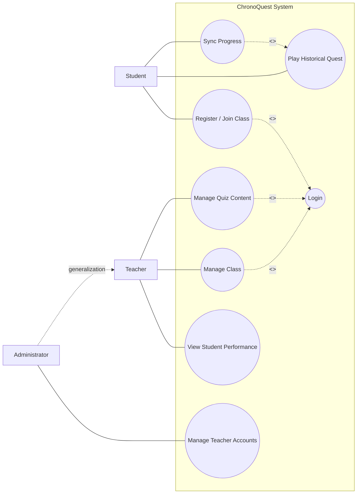

# USER-CASE

## ChronoQuest Use Case Diagram

```mermaid
flowchart LR
  student[Student]
  teacher[Teacher]
  admin[Administrator]

  subgraph system[ChronoQuest System]
    uc_login((Login))
    uc_register((Register / Join Class))
    uc_play((Play Historical Quest))
    uc_sync((Sync Progress))
    uc_view((View Student Performance))
    uc_class((Manage Class))
    uc_quiz((Manage Quiz Content))
    uc_admin_manage((Manage Teacher Accounts))
  end

  student --- uc_register
  student --- uc_play
  student --- uc_sync
  teacher --- uc_view
  teacher --- uc_class
  teacher --- uc_quiz
  admin --- uc_admin_manage

  admin -. generalization .-> teacher
  uc_register -. <<include>> .-> uc_login
  uc_class -. <<include>> .-> uc_login
  uc_quiz -. <<include>> .-> uc_login
  uc_sync -. <<extend>> .-> uc_play
```
